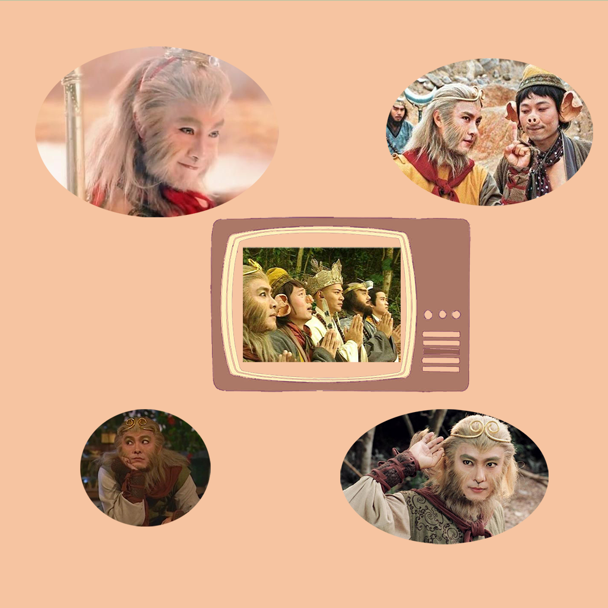

## 欢迎来到 港剧tv-我的童年回忆

在我们成长过程中，你是否也有过这种奇妙的感受，那些陪伴着我们度过快乐的童年的港剧，在童年时候对剧情和精彩片段的理解和感受是那样的纯粹童真。而当我们长大后，再翻看这些曾经充满回忆的经典港剧时，常常会有另一番感受，似乎明白了当初的疑惑。例如西游记中的孙悟空为什么会大闹天宫，这仅仅只是他顽皮的性格吗？显然现在的我不会单纯的这么认为。如果你也有这种奇妙的感受，你可以利用这款应用，将你童年时看过的港剧的感受和长大时候的你的感受记录起来，对比你回忆中的自己，你常常会发现有意外的收获。

如果您遇到什么需要解答的问题，请发送您的问题到以下邮箱。

我们将第一时间为您解答。

### 邮箱地址: zhanghesongyuan7@126.com

谢谢！
